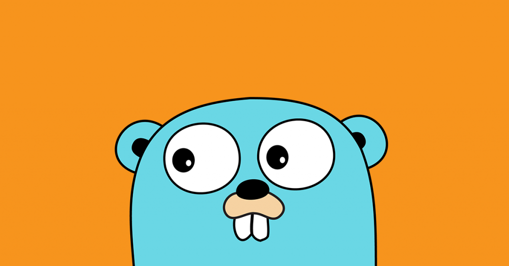

# 🐹 Learn Go Programming with Me

### This is the Go Programming guide for **beginners to experts**.  

> 💡 Remember: *Consistency is Key!*



---

## 📚 Table of Contents

| [Day 1](#day-1) | Introduction to Go & Setup |<br>
| [Day 2](#day-2) | Basic Syntax & Variables |<br>

---

## Day 1 
### Introduction 

- ✅ **Topics Covered:**  
  - Installing Go  
  - Learn go run, go build, go mod init.
  - Review variables, types, loops, functions. 
  - Writing your first Go program

*Example Code*
```go
package main

import "fmt"

func main() {
	fmt.Println("Hello, Go!")
}
```

## Day 2
### Dealing with data

- ✅ **Topics Covered:**  
  - Study structs, slices, maps, methods, interfaces.
  - Mini project named car-manager.

*Example Code*
```go
type Car struct {
	Brand string
	Year  int
	Price float64
}

func (c Car) Detail() (string, int, float64) {
	return c.Brand, c.Year, c.Price
}

func (c Car) Discount(percent float64) float64 {
	return c.Price - ((percent * 100) / c.Price)
}

func (c Car) Value() float64 {
	return c.Price
}

type Valuable interface {
	Value() float64
}
```

